# Rental Search Tracker

A collaborative rental search platform that helps roommates organize listings, compare apartments, manage landlord communication, and coordinate apartment hunting in one place.

🌐 Live Website: https://rental-search-tracker.vercel.app/

Built with Next.js, TypeScript, Supabase, OpenAI, and Google Maps APIs.

---

# Screenshots

## Dashboard

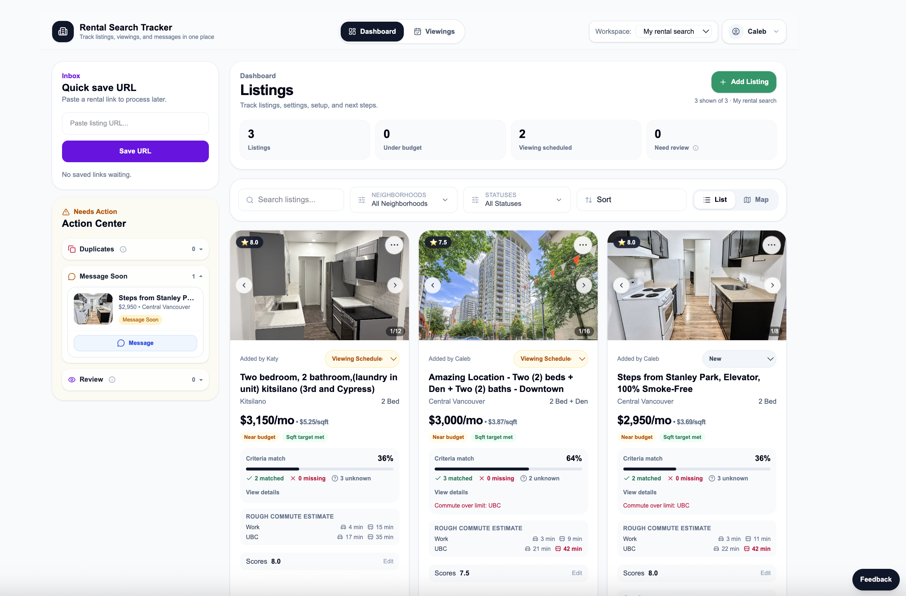

## Listing Details

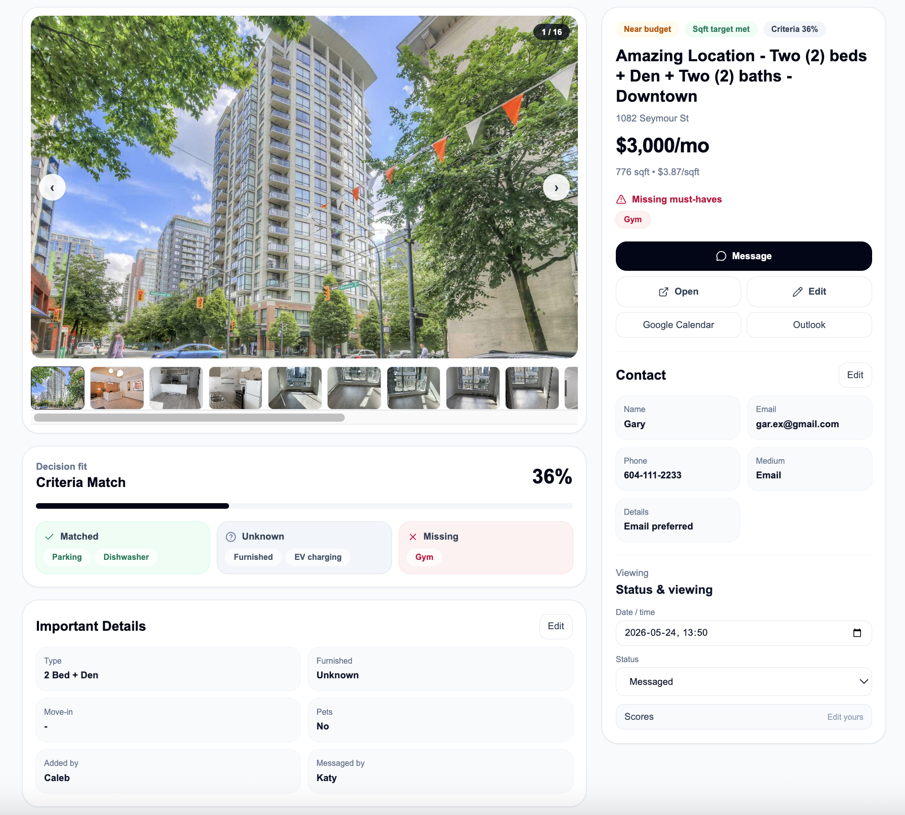

## Map View

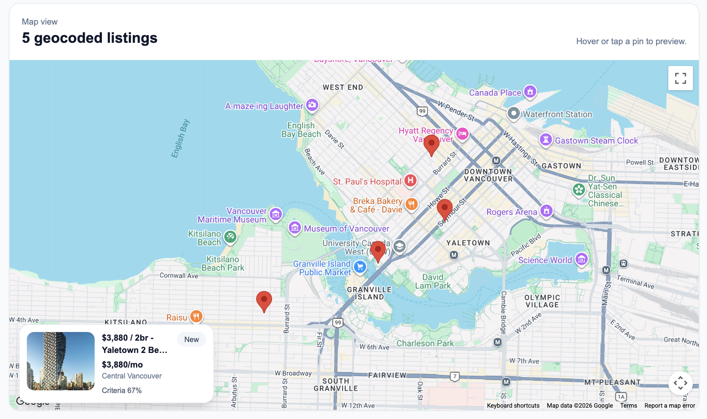

---

# The Problem

Apartment hunting with roommates is surprisingly chaotic.

Listings get buried in chats, duplicate links get shared repeatedly, preferences conflict between users, and landlord communication becomes difficult to track.

Most people end up using a combination of:
- spreadsheets
- screenshots
- browser tabs
- text messages
- notes apps

This project was built to turn rental searching into a structured collaborative workflow.

---

# Features

## Collaborative Workspaces

Users can create shared rental search workspaces and invite collaborators through secure invite links.

Features include:
- shared listing dashboard
- multi-user scoring
- shared criteria/preferences
- workspace-specific filters
- shared viewing schedules
- shared landlord communication history

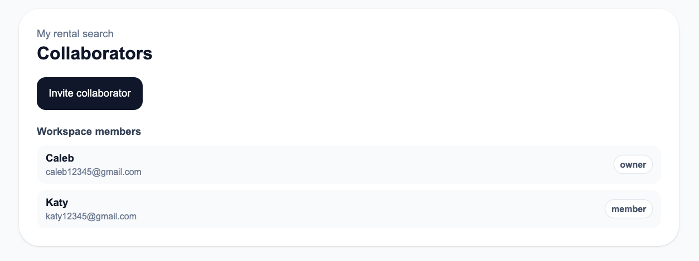

---

## Listing Management

Track listings throughout the entire apartment hunting workflow:
- add listings manually or by URL
- AI-assisted listing extraction
- image galleries
- duplicate detection
- lifecycle statuses
- notes and comments
- contact tracking

### Listing Card

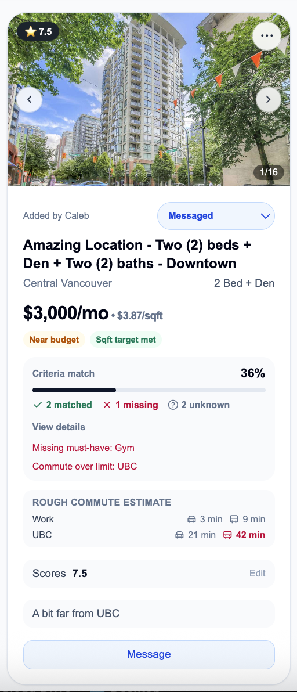

### Detailed Listing View


---

## Scoring & Decision Support

The app combines personal preferences, commute constraints, and listing attributes to help users evaluate apartments collaboratively.

Features:
- personalized scoring
- criteria matching
- missing must-have detection
- commute limit warnings
- shared top picks
- action prioritization

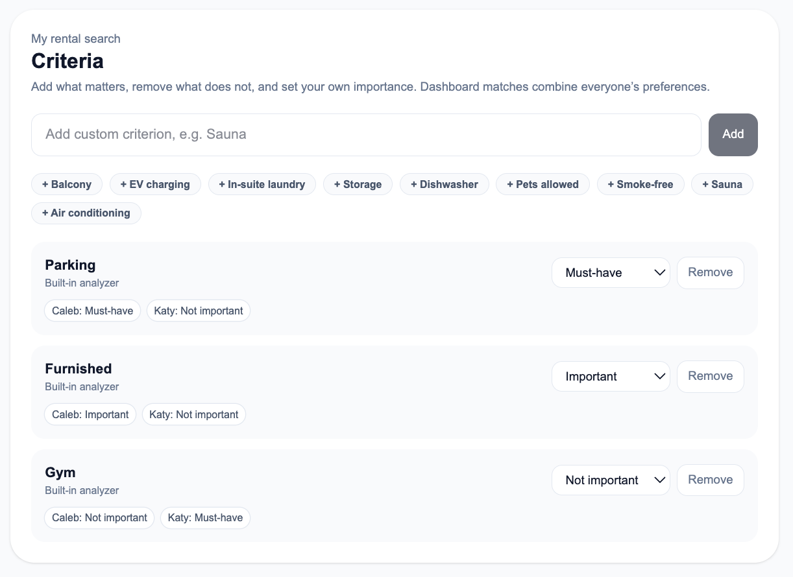

---

## Action Center

The Action Center highlights listings requiring attention, including:
- duplicates
- listings needing review
- follow-up reminders
- messaging tasks

The goal is to reduce cognitive overload during apartment hunting.

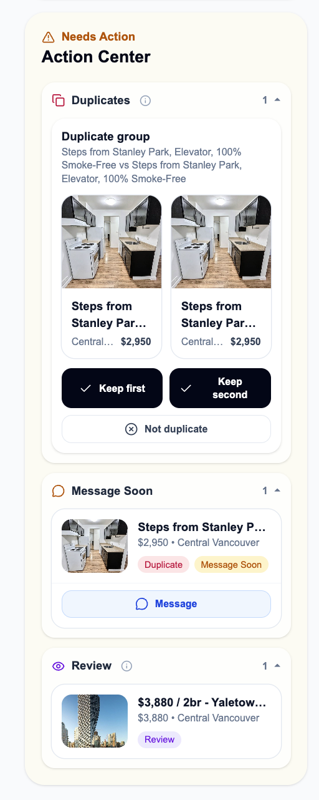

---

## Landlord Messaging Workflow

The app includes a reusable messaging system with:
- editable templates
- personalized variables
- contact autofill
- Gmail/Outlook integration
- outreach history tracking

### Message Templates

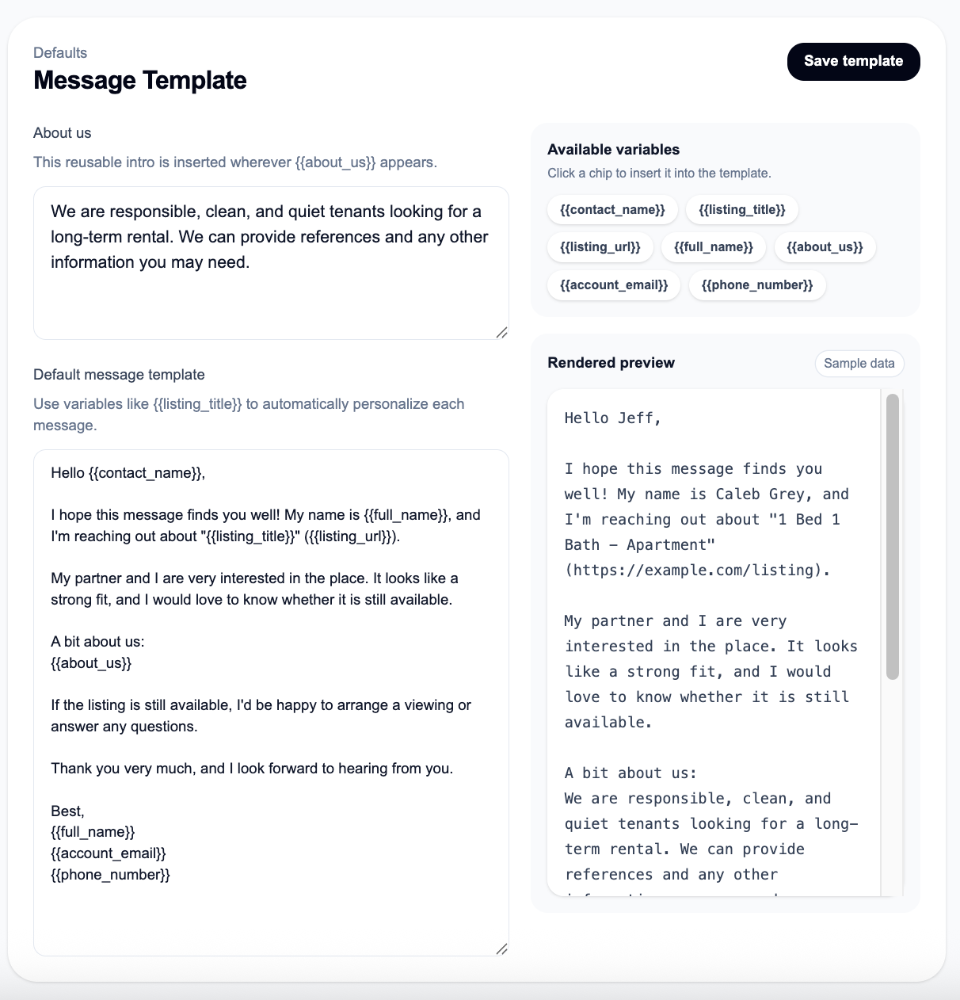

### Message Composer

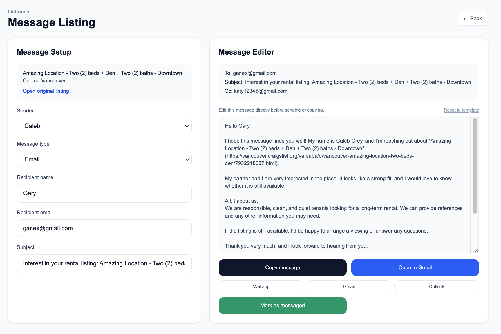

---

## Maps & Commute Estimation

Listings are geocoded and visualized on an interactive map.

Users can save frequent destinations (work, school, gym, etc.) and compare approximate commute times across listings.

### Frequent Places

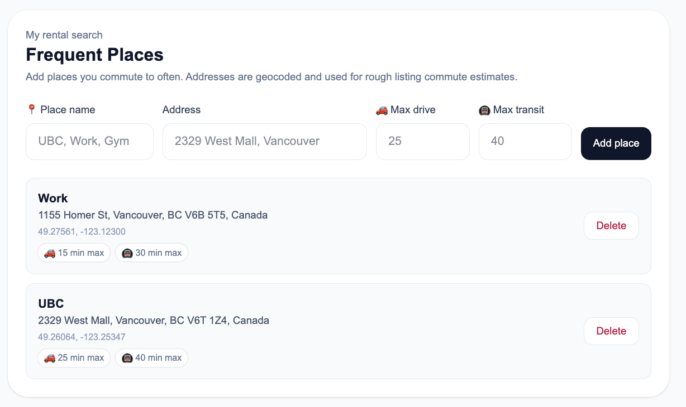

### Map View


---

## Viewing Scheduler

The app includes a dedicated viewing management workflow:
- upcoming and past viewing organization
- shared scheduling
- calendar integrations
- listing-linked appointments

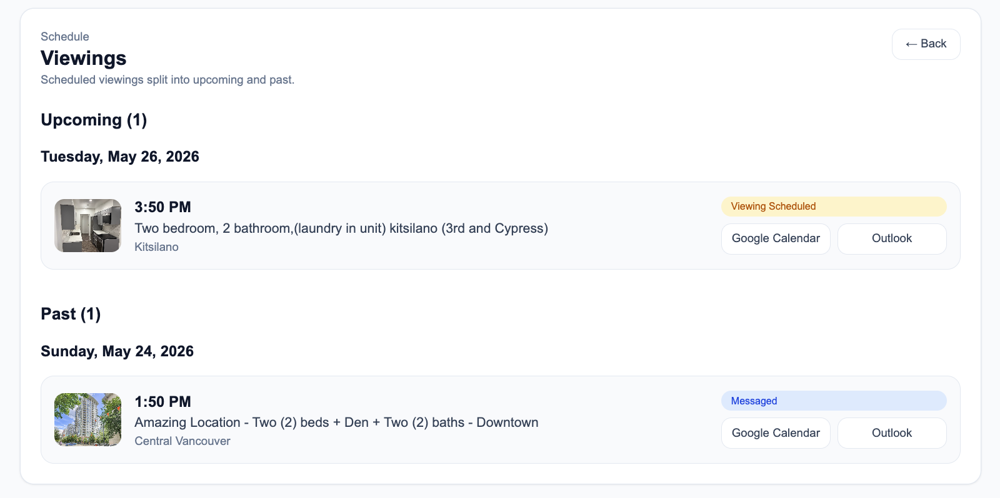

---

# Tech Stack

## Frontend
- Next.js 16 (App Router)
- React 19
- TypeScript
- Tailwind CSS

## Backend & Database
- Supabase
- PostgreSQL
- Supabase Auth
- Supabase Storage
- Row-Level Security (RLS)

## APIs & Integrations
- OpenAI Responses API
- Google Maps API
- Google Geocoding API

## Deployment
- Vercel

---

# Architecture

The application uses a multi-tenant workspace architecture.

Each rental search workspace contains:
- listings
- collaborators
- scores
- commute places
- criteria preferences
- messages

Access is protected using Supabase Row-Level Security policies.

Main architecture components:
- Next.js App Router frontend
- Supabase PostgreSQL database
- authenticated API routes
- AI-assisted extraction pipeline
- Google Maps/geocoding integration

```text
User
 ↓
Next.js App Router
 ↓
Server Actions / API Routes
 ↓
Supabase Auth + PostgreSQL + Storage
 ↓
RLS-protected workspace data

External APIs:
- OpenAI → listing extraction
- Google Maps / Geocoding → maps + commute estimates
- Gmail / Outlook / Mailto → landlord messaging
```

---

# Security & Data Isolation

The application uses Supabase Row-Level Security (RLS) to isolate workspace data between users.

Security features include:
- authenticated API access
- invite-based collaboration
- protected workspace membership
- HTTP-only auth cookies
- server-side geocoding
- protected environment variables

---

# Technical Challenges

Some of the more complex engineering challenges included:
- designing multi-user collaborative workflows
- implementing invite-based workspace onboarding
- synchronizing shared listing state across users
- building AI-assisted structured listing extraction
- designing flexible criteria/scoring systems
- handling commute estimation and geocoding
- maintaining secure workspace-level access with RLS

---

# Additional Screenshots

## Dashboard


## Action Center


## Criteria System


## Collaborators


---

# Local Development

Install dependencies:

```bash
npm install
```

Create `.env.local`:

```bash
NEXT_PUBLIC_SUPABASE_URL=...
NEXT_PUBLIC_SUPABASE_ANON_KEY=...
OPENAI_API_KEY=...
GOOGLE_MAPS_API_KEY=...
GOOGLE_GEOCODING_API_KEY=...
```

Run locally:

```bash
npm run dev
```

Open:

```text
http://localhost:3000
```

---

# Screenshot Capture

The project includes a Playwright screenshot script for capturing important UI states for design review.

Install Playwright browsers:

```bash
npx playwright install chromium
```

Run screenshot capture:

```bash
SCREENSHOT_BASE_URL="https://rental-search-tracker.vercel.app" \
SCREENSHOT_EMAIL="your-test-user@example.com" \
SCREENSHOT_PASSWORD="your-test-password" \
npm run screenshots
```

---

# Resume Highlights

- Built a full-stack collaborative workflow platform using Next.js, TypeScript, Supabase Auth, PostgreSQL, and Vercel
- Designed secure multi-tenant workspace architecture using Supabase Row-Level Security (RLS)
- Integrated AI-assisted rental listing extraction, commute estimation, and collaborative scoring systems
- Developed workflow-focused UX for apartment hunting, including messaging, duplicate detection, and shared decision-making tools

---

# Future Improvements

Planned future improvements include:
- browser extension for quick-save
- smarter duplicate detection
- reminder automation
- improved mobile experience
- analytics for rental comparisons

---

# What I Learned

This project strengthened my experience with:
- full-stack application architecture
- collaborative product design
- PostgreSQL schema design
- Row-Level Security
- API integrations
- workflow-oriented UX design
- deployment and production debugging